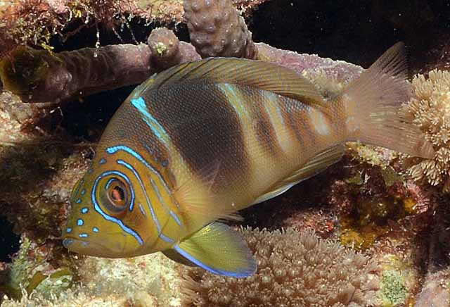
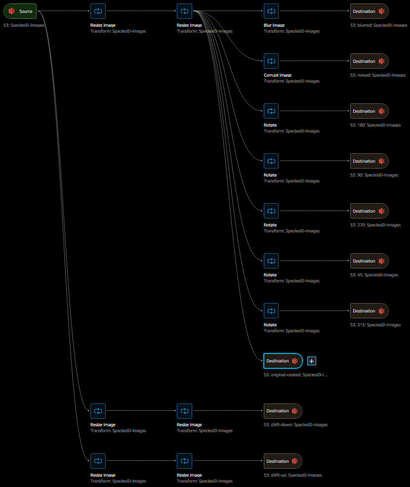

# SageMaker-Image-Classifier

## Project Overview

For this project, we will fine tune a pretrained image classification model, Resnet50, to predict the scientific species name of a Caribbean coral reef fish. For finetuning, performing image data augmentation, hosting the model, and endpoint deployment and inference, this project employs `PyTorch` and `AWS Sagemaker` via SageMaker's Studio (JupyterLab) in the AWS Management Console.

## Business Problem

Many apps exist to classify plants from images taken with your phone. As an avid scuba diver and reef species enthusiast, I've noticed that the only fish classification apps available are focused primarily on the type of fish one may catch sportfishing, and I have to do all my IDs manually. Thus, I thought to try my hand at producing a classifier for caribbean reef fish species!

## The Data

Over 7,000 images were scraped from various aquatic species references and databases such as the [Smithsonian](https://biogeodb.stri.si.edu/caribbean/en/pages) website and my personal favorite identification reference, [reefguide.org](https://reefguide.org/). There is severe class imbalance due to ease of acquiring images of certain species, as well as individual specie characteristics and behavior causing difficulty in acquiring identification-quality photos. For fun, here is a picture of my favorite commonly seen fish, the Barred Hamlet!

The `scraping` notebook contains all code used to scrape images, while the `creating_image_ID_DF` notebook contains all code related to preprocessing such as removal of duplicates, cleaning of references, identification of wrong/outdated scientific names, etc. This was performed on a local machine before uploading images to Amazon S3.

Finally, while the first training run was conducted on the scraped images, incremental training was performed using an augmented dataset to improve performance. To augment the dataset, AWS SageMaker's Data Wrangler was applied to resize, shift up or down, blur, add noise, or rotate original images at varying degrees.

## Results

In the end, two models were trained on `ml.p3.2xlarge` sagemaker instances. Training code can be found in the `fine_tuning_fishID` notebook, which was run on `SageMaker`. The first model was trained only on the original images and was run for 5 epochs while using a `HyperParameterTuner` to identify best hyperparameters for training while also beginning to fine tune the model on our dataset. Accuracy was improved over Zero Shot performance with the pretrained model by 20%. The second model was trained for 20 epochs on the augmented dataset, yielding another 20% improvement in validation accuracy over the first version.

## Areas for Improvement

The final accuracy is just shy of 65 %. However, we can continue to acquire images to improve performance. One way we could acquire images is using LangChain and the newly implemented vision capabilites in major LLMs to scrape for more high quality images not already found in the dataset. Google Images wasn't scraped at all, so in any implementation that remains an untapped resource. Second, while our dataset was augmented to increase the number of images tenfold, there remains a huge class imbalance in favor of more easily photographed species. Lastly, this implementation is quick and dirty, finetuning only the classification layer. Retraining with more control over the training steps will also improve results.

## Conclusions

Based on our results, we can assert that our POC result encourages further development of an application for identifying caribbean reef fish, a niche in a user-friendly nature identification service space that remains to be filled.